# :dna: 10x Genomics Spatial Transcriptomics — Assignment

A comprehensive analysis of spatial transcriptomics data using **Scanpy** and **Squidpy**.

---

## 📓 Notebooks With Full Results

| Notebook | View Full Results |
|----------|------------------|
| 01 - Basic Scanpy Spatial Analysis | [Open in Colab](https://colab.research.google.com/drive/1tSOPbUqmjRkyzIjGzBgg4GLovlCpmm24?usp=sharing) |
| 02 - Visium Fluorescence Analysis | [Open in Colab](https://colab.research.google.com/drive/13ZgE1CLI4eKXz2Wv36NbxD2P7o30nGQo?usp=sharing) |
| 03 - Visium H&E Analysis | [Open in Colab](https://colab.research.google.com/drive/1LdupcQ9yGkC-r5ICZ4q5XPNwlipU1gR6?usp=sharing) |
| 04 - Xenium Analysis | Code only (dataset requires 20GB+) |

---

## 📊 Notebook 01 — Basic Scanpy Spatial Analysis
> Dataset: Visium Human Lymph Node

### QC Distributions
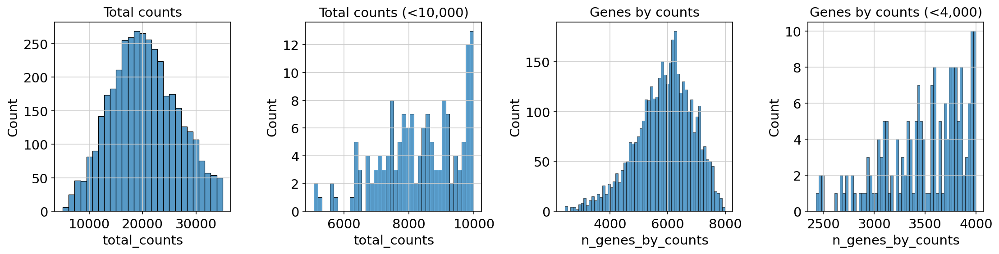

### UMAP Clusters
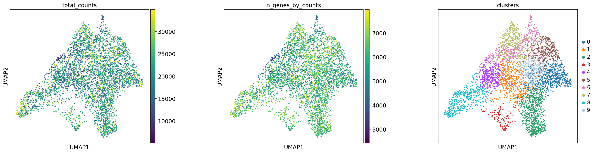

### Spatial QC on Tissue
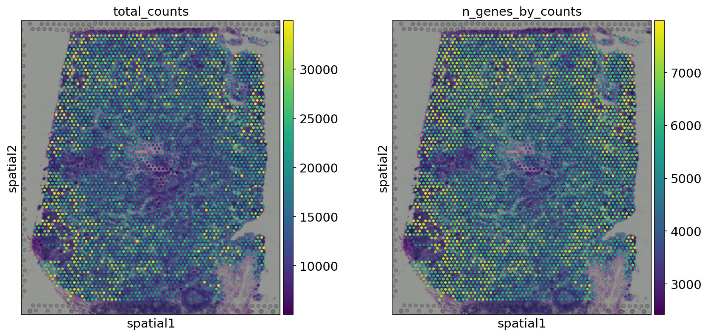

### Spatial Clusters on H&E Image
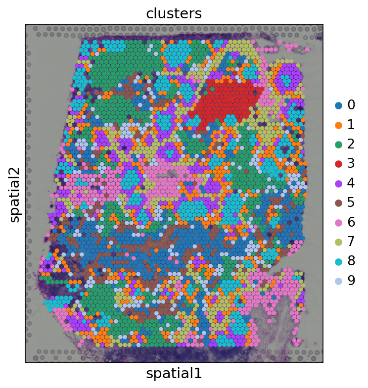

### Marker Genes
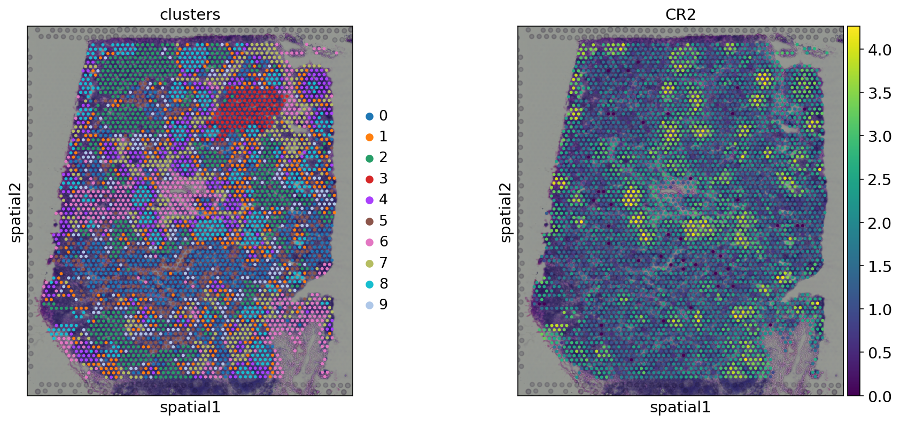

---

## 📊 Notebook 02 — Visium Fluorescence Analysis
> Dataset: Visium Mouse Brain (DAPI, anti-NEUN, anti-GFAP)

### Spatial Clusters
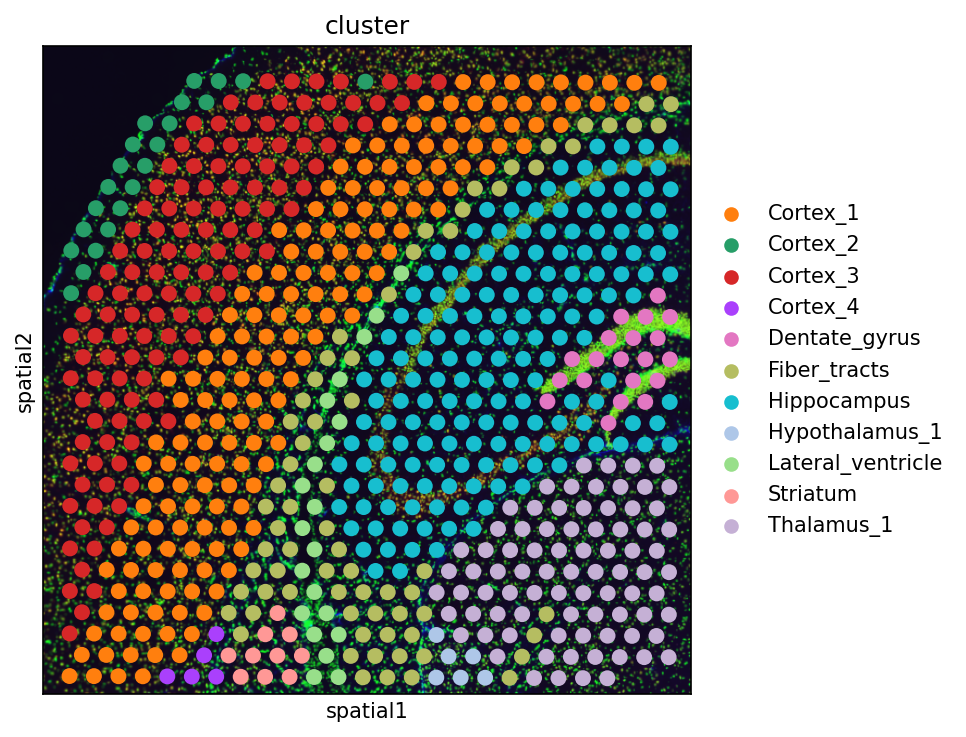

### Cell Segmentation
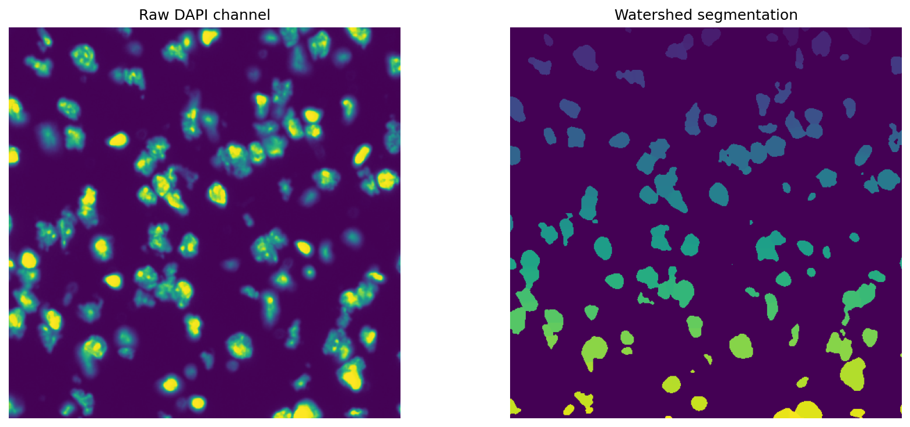

### Image Feature Clusters
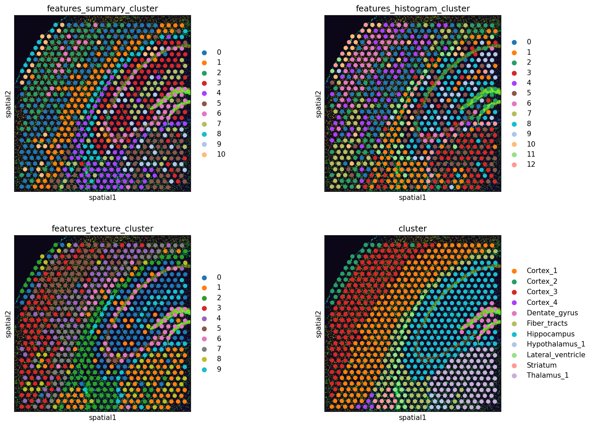

---

## 📊 Notebook 03 — Visium H&E Analysis
> Dataset: Visium Mouse Brain (H&E stained)

### Spatial Clusters


### Neighborhood Enrichment
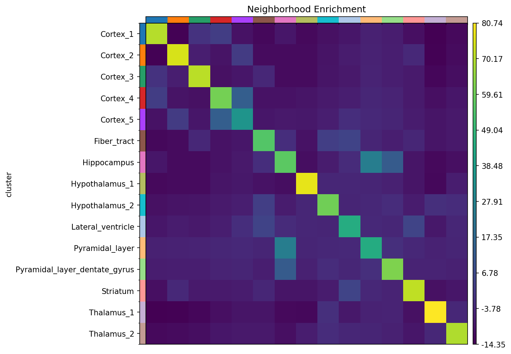

### Co-occurrence Score
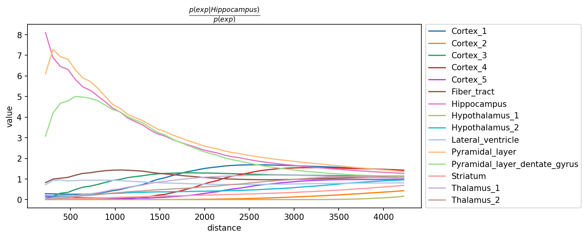

### Ligand-Receptor Interactions
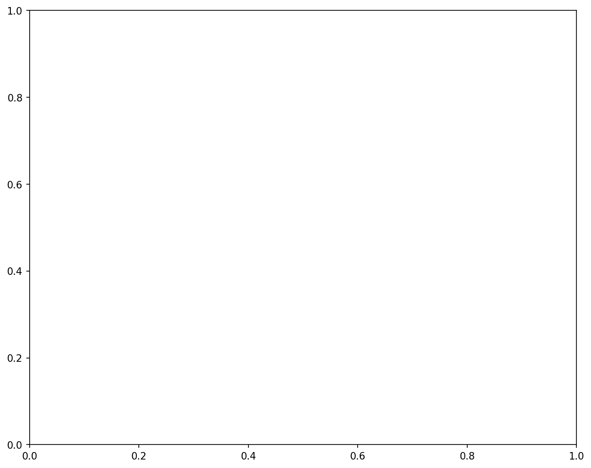

---

## 🗂️ Repository Structure
spatial-transcriptomics-10x/
├── README.md
├── environment/
│   ├── environment.yml
│   └── requirements.txt
├── notebooks/
│   ├── 01_scanpy_basic_spatial.ipynb
│   ├── 02_squidpy_visium_fluo.ipynb
│   ├── 03_squidpy_visium_hne.ipynb
│   └── 04_squidpy_xenium.ipynb
└── results/
├── 01_scanpy_basic_spatial_figures/
├── 02_squidpy_visium_fluo_figures/
└── 03_squidpy_visium_hne_figures/

---

## 🚀 Setup

```bash
conda env create -f environment/environment.yml
conda activate spatial-genomics
jupyter lab
```

---

## 📚 References

1. Wolf et al. (2018). *SCANPY.* Genome Biology.
2. Palla et al. (2022). *Squidpy.* Nature Methods.
3. Efremova et al. (2020). *CellPhoneDB.* Nature Protocols.

---

## 👤 Author
**Hamza Najeem** — Bioinformatics Assignment, 2026
